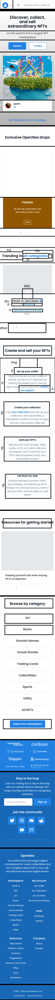
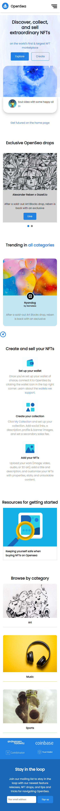
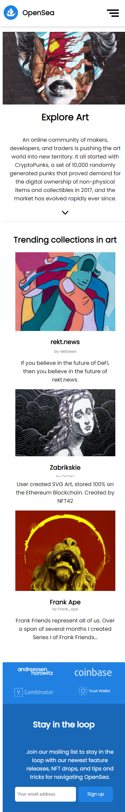

# Procesverslag
Markdown is een simpele manier om HTML te schrijven.  
Markdown cheat cheet: [Hulp bij het schrijven van Markdown](https://github.com/adam-p/markdown-here/wiki/Markdown-Cheatsheet).

Nb. De standaardstructuur en de spartaanse opmaak van de README.md zijn helemaal prima. Het gaat om de inhoud van je procesverslag. Besteedt de tijd voor pracht en praal aan je website.

Nb. Door *open* toe te voegen aan een *details* element kun je deze standaard open zetten. Fijn om dat steeds voor de relevante stuk(ken) te doen.

## Jij

uitwerken voor kick-off werkgroep

### Auteur:
Mathijs Nijhoff

#### Je startniveau:
Blauw

#### Je focus:
Surface plane
 

## Je website

uitwerken voor kick-off werkgroep

### Je opdracht:
https://opensea.io/

#### Screenshot(s) van de eerste pagina (small screen): 
Homepagina

#### Screenshot(s) van de tweede pagina (small screen):
Explore Art 

 

## Breakdownschets (week 1)

uitwerken na afloop 2e werkgroep

### de hele pagina: 

## Voortgang 1 (week 2)

uitwerken voor 1e voortgang

### Stand van zaken
hier dit ging goed & dit was lastig (neem ook screenshots op van delen van je website en code)

Ik vind het lastig om zonder divs en classes te werken.

Flexbox lukt me tot nu toe aardig goed.

### Agenda voor meeting
samen met je groepje opstellen

Mathijs wilt het hebben over het werken zonder classes.
Sterre, Ine en Arsenio willen checken of hun html en css semantisch is. Ze willen ook graag tips.

### Verslag van meeting
Ik moet mijn CSS herschrijven en meer op de verschillende selectoren letten. Bij mijn HTML moet ik er op letten dat ik minder classes gebruik en divs alleen waar echt nodig.

## Voortgang 2 (week 3)

uitwerken voor 2e voortgang

### Stand van zaken
Het ging redelijk goed. Ik was nog niet heel ver maar ik heb wel alle huiswerk opdrachten gedaan. Als ik eenmaal aan de code zit weet ik ook wel hoe het moet en gaat het best goed maar motivatie voor dit is 
een beetje laag.

### Agenda voor meeting
samen met je groepje opstellen

We wouden als groepje graag weten of onze structuur van de website goed is en we hadden een aantal vragen per persoon. 
We gingen met de student assisstenten een paar problemen oplossen.

### Verslag van meeting
We kregen wat tips van de student assisstenten over extensies en ze lieten blijken dat we allemaal goed bezig waren.

## Toegankelijkheidstest (week 4)

uitwerken na test in 8e voortgang

### Bevindingen
Lijst met je bevindingen die in de test naar voren kwamen:

Voice over functie apple:
Deze functie is pure drama, het werkt niet en is lastig te gebruiken. Het is niet gelukt om voice over alleen de headings te laten lezen.

Gele bril: geen problemen ondervonden, contrast is hoog.

Combined Loss Diabetic Eye Disease: Geen problemen, beetje vervelend maar niet hinderend.

Bril met vlek in het midden: Site is te gebruiken maar vlek is wel irritand.

Renier bevindingen, tekst is lastig te lezen met 3 brillen op. Ronde knopjes zijn niet te zien met 3 brillen.

Eigen bevindingen, met 3 brillen is de tekst niet te lezen.

Oplossing hiervoor is grote tekst en duidelijk contrast.

Met het spasme apparaat is de site te bedienen tenzij het op te hoge stand staat. Oplossing hiervoor is grote knoppen gebruiken.

De afleiding test is niet van toepassing omdat ik geen invoer velden heb. De focus state moet wel goed worden vormgegeven om duidelijk te maken waar je mee bezig was.

## Voortgang 3 (week 4)

uitwerken voor 3e voortgang

### Stand van zaken
De site was nog niet echt ver genog om veel feedback te krijgen. Ik heb wat van de huiswerk opdrachten in de website verwerkt.
Als ik eenmaal begin met coden lukt het me wel maar doordat ik het niet heel leuk vind begin ik er niet zo snel aan.

### Agenda voor meeting
samen met je groepje opstellen

We willen vooral weten of we ver genoeg zijn en hoe we onze website kunnen verbeteren.

### Verslag van meeting
Ik kwam hierdoor tot de conclusie dat ik wel echt door moet werken wil ik het nog halen. 

## Eindgesprek (week 5)

uitwerken voor eindgesprek

### Stand van zaken
Het coderen zelf ging wel goed maar ik merk dat mijn motivatie voor dit vak niet heel hoog was. Als ik eenmaal bezig was (en het lukte) dan was het best leuk.
Ik heb wel mijn best gedaan om iets moois te maken.

### Screenshot(s)

## Bronnenlijst

continu bijhouden terwijl je werkt

Nb. Wees specifiek ('css-tricks' als bron is bijv. niet specifiek genoeg).

1. https://unsplash.com/photos/-MCrF6hnojU
2. https://unsplash.com/photos/woC7_1c_kZQ
3. https://unsplash.com/photos/Wa9ilX9XYOI
4. https://unsplash.com/photos/NWJOf03vXKQ
5. https://unsplash.com/photos/GfQEdpIkkuw
6. https://www.flaticon.com/premium-icon/stats_3202387?term=stats&page=1&position=7&page=1&position=7&related_id=3202387&origin=search
7. https://www.flaticon.com/premium-icon/market-trends_2967338?term=market&page=1&position=2&page=1&position=2&related_id=2967338&origin=search
8. https://www.flaticon.com/premium-icon/user_1144760?term=account&page=1&position=2&page=1&position=2&related_id=1144760&origin=search
9. https://www.flaticon.com/free-icon/wallet_482541?term=wallet&page=1&position=2&page=1&position=2&related_id=482541&origin=search
10. https://opensea.io/
11. https://codepen.io/
12. https://dlo.mijnhva.nl/d2l/home/324287

